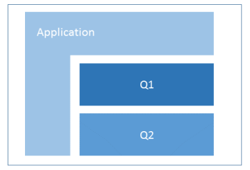
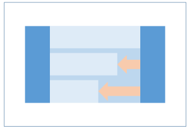

 
 
[           ](https://godoc.org/github.com/zew/go-questionaire)    

# Go-Questionaire 

A http(s) webserver serving questionaires.

## Status

Version 1.0

## Usage

Install and setup [golang](https://golang.org/doc/install)

    cd $HOME/go/src/github.com/zew
    go get -u github.com/zew/go-questionaire
    cd go-questionaire
    mv config-example.json  config.json  # adapt to your purposes
    mv logins-example.json  logins.json  # dito
    touch ./templates/site.css           # put your site's styles here
    go build
    ./go-questionaire                    # under windows: go-questionaire.exe

More info in [deploy on linux/unix](./static/doc/linux-instructions.md)

#### Create questionaire and logins

* Login as admin https://dev-domain:port/survey/login-primitive

* Create the base questionaire template - as JSON file  
 https://dev-domain:port/survey/generate-questionaire-templates

* Generate login hashes  
   i.e.  https://dev-domain:port/survey/generate-hashes?wave_id=2018-07&survey_id=fmt   
  yielding
  
      /survey?u=99000&survey_id=fmt&wave_id=2018-07&h=bc11262f8ce8dda558de9a0ffa064941
      ...

#### Participant login and reset

* Participants can now use these links to [login as user x](https://dev-domain:port/survey?u=98991&survey_id=fmt&wave_id=2018-07&h=4059d765e4a4f211658373c07c5affb9)   

* They can now [access the questionaire](https://dev-domain:port/survey)

* For testing purposes, you may [reset the questionaire](https://dev-domain:port/survey/reload-from-questionaire-template?u=98991&survey_id=fmt&wave_id=2018-07&h=4059d765e4a4f211658373c07c5affb9)

## Semantics

* Package `qst` contains generic functions to create questionaires.

* Package `generators` uses qst for creating specific JSON questionaires.  

* Application contains multi-language surrounding  
and common functions for login, validation, session...

* Application renders questionaires.  
Different questionaires are separated by login.

* Survey results are pulled in by the `transferrer`. 

## Data thrift

* Surveys contain no personal data - only a participant ID, the questions and the answers.

* The `transferrer` pulls in the responses from an internet server.

* Once inside your organization, the results are fed into any JSON reading application.

## Technical design principles

* All content and all results are driven  
by __JSON files__.

* No database required.

* Server side validation.

* Client side JS validation is deliberately omitted;  
   [a would-be JS client lib](http://www.javascript-coder.com/html-form/form-validation.phtml)

* Package `systemtest` performs full circle roundtrip - filling out a questionaire and comparing the 
server JSON file with the entered data.

* Column width for any label or form element can be set individually (`ColSpanLabel` and `ColSpanControl`)

* Each label or form element can be styled additionally (`CSSLabel` and `CSSControl`)

#### Page navigation sequence - special pages

* Pages can be navigated by page number sequence using http params `previous` and `next` 

* Pages can be navigated using `page` = [0,1,...] parameter

* Page property `NoNavigation` decouples the page from the navigational sequence.  
They are exempt from `previous` and `next`.  
Such pages can reached to by setting submit buttons to their index value.  
Useful for greeting- and goodbye-pages.

#### Defining questionaires by code or by JSON file

At inception we envisioned a JSON schema validator  
and questionaire creation by directly editing of JSON files  
but that remains as elusive as it did with XML.

### Layout concept

#### Accepted solution

Considering `float-left` or `inline-block`, we chose `fixed table` layout.

We need full fledged markup, since mere CSS classes such as `<div style='display: table/table-row/table-cell'` do not support colspan or rowspan functionality. 

Page width can be adjusted for each page. 
Squeezing or stretching all rows equally.
Page remains horizontally _centered_.

Each input group width can be adjusted.
The input group remains left-aligned.

Each input group has flexible number of columns.
It is deliberately not standardized on hundred,
so that odd distributions are possible - i.e. seven columns.

The inputs are fitted in. Usual an input occupies one column 
for its label and another column for its control part.
These numbers are customizable, so that any distribution
of labels and controls on an arbitrary grid is possible.

Use textblocks with `&nbsp;` to create empty space.

The layout engine creates new rows, if the inputs have filled up
the number of columns defined per group.

Group property `OddRowsColoring` to activate alternating background

The table border can be set via ./templates/site.css  
`table.bordered td { myBorderCSS }`

Vertical alignment is baseline for everything outside the input tables.
Input tables are vertically middled.

We might introduce InputT.VAlignLabel and InputT.VAlignControl to customize this in future.

#### Rejected solutions

Inline block suffers from the disadvantage, that 
the white space between inline block elements subtracts from the total width.
The column width computation must be based on a compromise slack of i.e. 97.5 percent.

Stacking cells wit `float: left` takes away the nice vertical middle alignment of the cells.

### Mobile layout

go-questionaire has a _separate_ layout for mobile clients.
Hybrid solutions (_mobile first_) were considered complex and insufficient.

The HTML rendering of groups and inputs remains unchanged.
Global layout template and CSS files are different.
Instead of progress bar and footer navigation, mobile clients get a `mobile menu`.

The mobile layout is free of any JavaScript.

Switching is done based on the user agent string, but can be overridden by `mobile` parameter.
0 - automatic. 1 - mobile forced. 2 - desktop forced.

Table layout `fixed` must be relinguished, otherwise labels and controls are cropped on devices with very small width.

## Optimization

* Saving only responses to session/JSON; not the entire questionaire data.

* Table data is aligned vertically middle. Sometimes it should be configurable to baseline. 

## About Go-App-Tpl

* Go-Questionaire is based on Go-App-Tpl

* Go-App-Tpl is a number of packages for building go web applications.  

It features

  * Http router with safe settings and optional https encryption

  * Session package by Alex Edwards

  * Configurable url prefix for running multiple instances on same server:port

  * Middleware for logging, access restrictions etc.

  * Middleware catches request handler panics

  * Static file handlers
  
  * JSON config file with reloadable settings 

  * JSON logins file, also reloadable
  
  * Handlers for login, changing password, login by hash

  * Site layout template with jQuery from CDN cache; fallback to localhost 

  * Multi language strings

  * Templates having access to session and request

  * Stack of dynamic subtemplate calls 
  
  * Template pre-parsing, configurable for development or production

  * Markdown file handler, rewriting image links 
  
  * Multi language markdown files
  
  * Shell script to control application under Linux

  * CSRF and XSS defence

  

## Technical design guidelines

* Subpackaging is done by concern, neither too amorphous nor too atomic. 

* Go-App-Tpl has no "hooks" or interfaces for isolation of "framework" code.  
Just copy it and add your handlers. 

Future updates can be merged.

