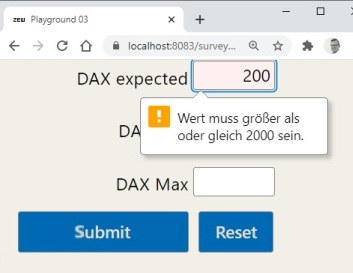

# HTML5 Validation

[Presentation on youtube - in German](https://youtu.be/BaV0ebrcepY)  
use `caption (auto-generated)` and then `auto translate ... English`  
to view English subtitling

## Default validation

HTML5 provides - highly idiosyncratic - built-in validation features.  
Let's discuss them.

Following image shows a default validation error;  
a bubble message appears in German, saying  
`Value must be greater or equal 2000`.

  

* Visual appearance of the bubble messages cannot be influenced at all.

* Error messages are displayed in the language, configured in the web browser.  
In Chrome for instance

  * Settings
  * Language
  * [List of installed languages]
  * Display Google Chrome in this language
  * [restart]
  
&nbsp; &nbsp; ...will affect the language of the messages

* The error messages are pretty mathematical  
 `Value must be greater or equal to ...`

* We can change the error messages using the method `setCustomValidity('my message')`  
but this puts the input element into the `invalid` state,  
regardless of its content.  
This creates a serious source of errors in higher-up logic.  
In the worst case, the user gets trapped on the HTML page with an unreasonable error message.

* Positioning and sizing of the bubble messages do not overflow the page contents.  
This is a big advantage.  

### On `input`, on `blur` and on `form submit`

1. We might want validation feedback on every key stroke;  
this is called `on input` validation.

2. Or we might want feedback before the user moves on  
to the next input element; technically called `on blur` or `on focusout` validation.

3. Finally we might want validation on `form submission`.  
One or all bubble messages should be shown to the user.  
And we may or may not want to block submission of an invalid form.

Built-in HTML5 validation gives us limited control over 1.)
and equally limited control over 3.)

### Compound validation

* We might want to enforce rules over several input elements.

* Our demonstration contains two real world examples of compound validation:  
  * Three input elements that should add up to 100%

  * Three input elements, asking for a stock index forecast,  
  where the first value should be in between the last two values,  
  and the second value should be smaller than the third.  

  * All forecast values should be between 2000 and 25.000.  
  We use HTML5 `number` elements to enforce some of our restrictions.

* There is no way to enforce such rules across several input elements with HTML5 alone.

## Custom validation - I

If you have concluded, that built-in HTML5 validation is insufficient for you,  
then you want to develop a _custom_ validation.  
Lets lay the foundation for this.

* We dont want jQuery anymore;  
we dont want Javascript libraries.

* We want to minimize asynchroneous functionality,  
cascading of events, Javascript `promises`.

* We have to disable the built-in bubbles.  
Three possibilities are documented in the code under `suppressBuiltinBubbles`.  
The best solution is by setting `<form novalidate=true>`.  
We can still use `validity` and `checkValidity()` on input elements,  
obtaining its overall validity (`[true|false]`) or its details (i.e. `uppperBoundOverflow`).  
We could also call `reportValidity()`, to re-establish the previous behavior,  
but our objective is to improve on default functionality,  
not merely re-institute it.

* We have to create our own visual elements.  
We call these `custom popups`.  
As opposed to the _built-in_ bubble messages discussed above.  

## Custom validation - II

* We have the `:valid` and `:invalid` `CSS` `pseudo classes`;  
they can trigger an instant validation feedback on every keystroke.  
They are useful to effect color changes or for displaying check ticks.  
But creating and displaying fully fledged `custom popups` based on CSS pseudo classes  
relies on a _specific_  _sequence_ of HTML elements.  
This is not a robust solution.  
Consequently, we have to use `parent.insertAdjacentHTML([popupHTML])`  
to create our custom popups.  `insertAdjacentHTML`  
does not destroy existing event handler registrations.

### Positioning of custom popups

* Dynamic display right _or_ left depending on screen position  
can only be achieved using JavaScript.  
We dont want this added complexity.  
We therefore settle on positioning our custom popups _below_  the input element;  
keeping in mind, that our solution needs to work on narrow `mobile` screens as well.

* The width of the custom popups constitutes the next problem.  
It cannot be as narrow as the input element, which might be just one or two digits wide.  
But it must be prevented from overflowing the screen width.

* Our solution is to make the width 100% of the  _parent_ or _grandparent_ of the input element.  
Usage of  _parent_ or _grandparent_ can be configured using the `attachGrandparent` parameter.

### Live demo

[Live demo](https://survey2.zew.de/doc/html5-form-validation/playground-03.html)

* This is the real-life example mentioned above

* Technically, its a `form` containing a bunch of HTML5 number inputs

* Custom error messages have been put into `data-validation_msg` attribute

### Notes

* Compound validation messages must be prevented  
from interfering with/superseding input based validation messages;  
`IsCleanForm(event)` checks for this.

## Questions

* The CSS `:invalid` class is not triggered for compound invalidations.
